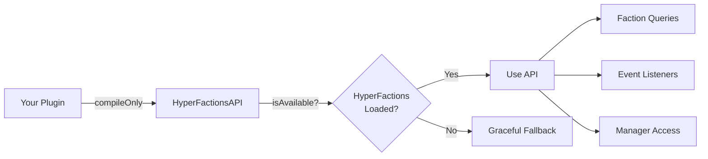

# HyperFactions Developer API Reference

> **Version**: 0.7.0 | **Package**: `com.hyperfactions.api`

This document is for third-party mod developers who want to hook into HyperFactions from their own plugins.

---

## Table of Contents

- [Getting Started](#getting-started)
- [Faction Queries](#faction-queries)
- [Power System](#power-system)
- [Territory](#territory)
- [Relations](#relations)
- [Zones](#zones)
- [Combat](#combat)
- [Protection](#protection)
- [Manager Access](#manager-access)
- [Economy API](#economy-api)
- [Event System](#event-system)

---

## Getting Started

### Dependency Setup

Add HyperFactions as a compile-only dependency in your `build.gradle`:

```gradle
dependencies {
    compileOnly project(':HyperFactions')
    // or if using a JAR directly:
    compileOnly files('libs/HyperFactions-0.7.0.jar')
}
```

Add the soft dependency in your `manifest.json`:

```json
{
  "optionalDependencies": {
    "HyperSystems:HyperFactions": "0.7.0"
  }
}
```

### Runtime Detection

Always check availability before calling API methods:

```java
import com.hyperfactions.api.HyperFactionsAPI;

if (HyperFactionsAPI.isAvailable()) {
    Faction faction = HyperFactionsAPI.getPlayerFaction(playerUuid);
    // Safe to use
}
```



---

## Faction Queries

| Method | Returns | Description |
|--------|---------|-------------|
| `getFaction(UUID factionId)` | `@Nullable Faction` | Get faction by ID |
| `getFactionByName(String name)` | `@Nullable Faction` | Get faction by name (case-insensitive) |
| `getPlayerFaction(UUID playerUuid)` | `@Nullable Faction` | Get a player's faction |
| `isInFaction(UUID playerUuid)` | `boolean` | Check if a player is in any faction |
| `getAllFactions()` | `Collection<Faction>` | Get all factions |

### Example

```java
Faction faction = HyperFactionsAPI.getPlayerFaction(playerUuid);
if (faction != null) {
    String name = faction.getName();
    UUID leaderId = faction.getLeader();
    int memberCount = faction.getMembers().size();
}
```

---

## Power System

| Method | Returns | Description |
|--------|---------|-------------|
| `getPlayerPower(UUID playerUuid)` | `@NotNull PlayerPower` | Get player's power data |
| `getFactionPower(UUID factionId)` | `double` | Get faction's total power |

### Example

```java
PlayerPower power = HyperFactionsAPI.getPlayerPower(playerUuid);
double current = power.power();
double max = power.maxPower();

double factionPower = HyperFactionsAPI.getFactionPower(factionId);
```

---

## Territory

| Method | Returns | Description |
|--------|---------|-------------|
| `getClaimOwner(String world, int chunkX, int chunkZ)` | `@Nullable UUID` | Get faction ID owning a chunk |
| `isClaimed(String world, int chunkX, int chunkZ)` | `boolean` | Check if a chunk is claimed |

### Example

```java
// Convert world coordinates to chunk coordinates
int chunkX = (int) Math.floor(x) >> 4;
int chunkZ = (int) Math.floor(z) >> 4;

UUID owner = HyperFactionsAPI.getClaimOwner("world", chunkX, chunkZ);
if (owner != null) {
    Faction owningFaction = HyperFactionsAPI.getFaction(owner);
}
```

---

## Relations

| Method | Returns | Description |
|--------|---------|-------------|
| `getRelation(UUID factionId1, UUID factionId2)` | `@NotNull RelationType` | Get relation between two factions |
| `areAllies(UUID factionId1, UUID factionId2)` | `boolean` | Check if two factions are allied |
| `areEnemies(UUID factionId1, UUID factionId2)` | `boolean` | Check if two factions are enemies |

`RelationType` values: `ALLY`, `ENEMY`, `NEUTRAL`

### Example

```java
Faction playerFaction = HyperFactionsAPI.getPlayerFaction(playerUuid);
Faction targetFaction = HyperFactionsAPI.getPlayerFaction(targetUuid);

if (playerFaction != null && targetFaction != null) {
    RelationType relation = HyperFactionsAPI.getRelation(
        playerFaction.getId(), targetFaction.getId()
    );

    if (relation == RelationType.ALLY) {
        // Friendly interaction
    }
}
```

---

## Zones

| Method | Returns | Description |
|--------|---------|-------------|
| `isInSafeZone(String world, int chunkX, int chunkZ)` | `boolean` | Check if chunk is in a SafeZone |
| `isInWarZone(String world, int chunkX, int chunkZ)` | `boolean` | Check if chunk is in a WarZone |

---

## Combat

| Method | Returns | Description |
|--------|---------|-------------|
| `isCombatTagged(UUID playerUuid)` | `boolean` | Check if a player is combat tagged |

### Example

```java
if (HyperFactionsAPI.isCombatTagged(playerUuid)) {
    // Deny teleportation, logout, etc.
}
```

---

## Protection

| Method | Returns | Description |
|--------|---------|-------------|
| `canBuild(UUID playerUuid, String world, double x, double z)` | `boolean` | Check build permission at coordinates |
| `getProtectionChecker()` | `@NotNull ProtectionChecker` | Get the protection checker for advanced checks |

The `ProtectionChecker` provides fine-grained checks for different interaction types (BUILD, INTERACT, CONTAINER, DOOR, BENCH, PROCESSING, SEAT, DAMAGE, USE).

### Example

```java
// Simple build check
if (HyperFactionsAPI.canBuild(playerUuid, "world", x, z)) {
    // Allow block placement
}

// Advanced protection check
ProtectionChecker checker = HyperFactionsAPI.getProtectionChecker();
// Use checker methods for specific interaction types
```

---

## Manager Access

For advanced use cases, you can access individual managers directly. This gives you full control over faction operations beyond the convenience methods above.

| Method | Returns | Description |
|--------|---------|-------------|
| `getFactionManager()` | `FactionManager` | CRUD operations, membership, roles |
| `getClaimManager()` | `ClaimManager` | Territory claiming, spatial indexing |
| `getPowerManager()` | `PowerManager` | Player power, regeneration, penalties |
| `getRelationManager()` | `RelationManager` | Ally/enemy/neutral diplomacy |
| `getZoneManager()` | `ZoneManager` | SafeZone/WarZone management |
| `getCombatTagManager()` | `CombatTagManager` | Combat tagging, spawn protection |
| `getTeleportManager()` | `TeleportManager` | Faction home teleportation |
| `getInviteManager()` | `InviteManager` | Invite management with expiration |

> **Note**: Manager methods are internal APIs and may change between versions. Prefer the top-level `HyperFactionsAPI` convenience methods where possible.

---

## Economy API

The `EconomyAPI` interface provides access to faction treasury operations. Obtain the implementation from the `EconomyManager`:

```java
EconomyAPI economy = HyperFactionsAPI.getInstance().getEconomyManager();
if (economy.isEnabled()) {
    double balance = economy.getFactionBalance(factionId);
}
```

### Transaction Results

All mutating operations return `CompletableFuture<TransactionResult>`:

| Result | Description |
|--------|-------------|
| `SUCCESS` | Transaction completed |
| `INSUFFICIENT_FUNDS` | Not enough balance |
| `INVALID_AMOUNT` | Amount is negative or zero |
| `FACTION_NOT_FOUND` | Faction does not exist |
| `PLAYER_NOT_FOUND` | Player does not exist |
| `NOT_IN_FACTION` | Player is not in the faction |
| `NO_PERMISSION` | Actor lacks permission |
| `ERROR` | Unexpected error |

### Transaction Types

| Type | Description |
|------|-------------|
| `DEPOSIT` | Player deposits money |
| `WITHDRAW` | Player withdraws money |
| `TRANSFER_IN` | Incoming inter-faction transfer |
| `TRANSFER_OUT` | Outgoing inter-faction transfer |
| `UPKEEP` | Periodic upkeep deduction |
| `TAX_COLLECTION` | Tax revenue |
| `WAR_COST` | Cost of declaring war |
| `RAID_COST` | Cost of raiding |
| `SPOILS` | War/raid spoils |
| `ADMIN_ADJUSTMENT` | Admin balance modification |

### Balance & History Methods

| Method | Returns | Description |
|--------|---------|-------------|
| `getFactionBalance(UUID factionId)` | `double` | Get treasury balance (0.0 if not found) |
| `hasFunds(UUID factionId, double amount)` | `boolean` | Check if faction has sufficient funds |
| `getTransactionHistory(UUID factionId, int limit)` | `List<Transaction>` | Get recent transactions (newest first) |
| `getCurrencyName()` | `String` | Singular currency name (e.g., "dollar") |
| `getCurrencyNamePlural()` | `String` | Plural currency name (e.g., "dollars") |
| `formatCurrency(double amount)` | `String` | Formatted string (e.g., "$1,234.56") |
| `isEnabled()` | `boolean` | Whether economy is available |

### Mutating Methods

| Method | Returns | Description |
|--------|---------|-------------|
| `deposit(UUID factionId, double amount, UUID actorId, String desc)` | `CompletableFuture<TransactionResult>` | Deposit into treasury |
| `withdraw(UUID factionId, double amount, UUID actorId, String desc)` | `CompletableFuture<TransactionResult>` | Withdraw from treasury |
| `transfer(UUID from, UUID to, double amount, UUID actorId, String desc)` | `CompletableFuture<TransactionResult>` | Transfer between factions |

### Transaction Record

```java
record Transaction(
    @NotNull UUID factionId,     // Faction involved
    @Nullable UUID actorId,      // Player who initiated (null for system)
    @NotNull TransactionType type,
    double amount,
    double balanceAfter,
    long timestamp,
    @NotNull String description
)
```

### Example

```java
EconomyAPI economy = HyperFactionsAPI.getInstance().getEconomyManager();

// Check balance
double balance = economy.getFactionBalance(factionId);

// Deposit with async result
economy.deposit(factionId, 500.0, playerUuid, "Quest reward")
    .thenAccept(result -> {
        if (result == TransactionResult.SUCCESS) {
            player.sendMessage("Deposited " + economy.formatCurrency(500.0));
        }
    });

// Transfer between factions
economy.transfer(fromFactionId, toFactionId, 1000.0, playerUuid, "Trade payment")
    .thenAccept(result -> {
        if (result == TransactionResult.INSUFFICIENT_FUNDS) {
            player.sendMessage("Not enough funds!");
        }
    });
```

---

## Event System

HyperFactions publishes events through a lightweight `EventBus`. Register listeners to react to faction state changes.

### EventBus Methods

| Method | Description |
|--------|-------------|
| `EventBus.register(Class<T>, Consumer<T>)` | Register a listener for an event type |
| `EventBus.unregister(Class<T>, Consumer<T>)` | Unregister a listener |
| `EventBus.publish(T)` | Publish an event (internal use) |
| `EventBus.clearAll()` | Clear all listeners (internal use) |

Convenience methods are also available on `HyperFactionsAPI`:

```java
HyperFactionsAPI.registerEventListener(FactionCreateEvent.class, event -> { ... });
HyperFactionsAPI.unregisterEventListener(FactionCreateEvent.class, listener);
```

### Events

#### FactionCreateEvent

Fired when a new faction is created.

```java
public record FactionCreateEvent(
    @NotNull Faction faction,    // The created faction
    @NotNull UUID creatorUuid    // Player who created it
)
```

#### FactionDisbandEvent

Fired when a faction is disbanded. `disbandedBy` is null for system-initiated disbands (e.g., last member leaves).

```java
public record FactionDisbandEvent(
    @NotNull Faction faction,      // The disbanded faction
    @Nullable UUID disbandedBy     // Player who disbanded, or null for system
)
```

#### FactionClaimEvent

Fired when a faction claims a chunk.

```java
public record FactionClaimEvent(
    @NotNull Faction faction,    // The claiming faction
    @NotNull UUID claimedBy,     // Player who claimed
    @NotNull String world,       // World name
    int chunkX,                  // Chunk X coordinate
    int chunkZ                   // Chunk Z coordinate
)
```

#### FactionMemberEvent

Fired when a player's membership status changes.

```java
public record FactionMemberEvent(
    @NotNull Faction faction,    // The faction
    @NotNull UUID playerUuid,    // Affected player
    @NotNull Type type           // Change type
) {
    public enum Type {
        JOIN,     // Player joined the faction
        LEAVE,    // Player left voluntarily
        KICK,     // Player was kicked
        PROMOTE,  // Player was promoted
        DEMOTE    // Player was demoted
    }
}
```

### Listener Example

```java
import com.hyperfactions.api.events.*;

public class MyPlugin {

    private Consumer<FactionCreateEvent> createListener;

    public void onEnable() {
        if (!HyperFactionsAPI.isAvailable()) return;

        createListener = event -> {
            System.out.println("New faction: " + event.faction().getName()
                + " by " + event.creatorUuid());
        };

        EventBus.register(FactionCreateEvent.class, createListener);
        EventBus.register(FactionMemberEvent.class, this::onMemberChange);
    }

    public void onDisable() {
        if (createListener != null) {
            EventBus.unregister(FactionCreateEvent.class, createListener);
        }
    }

    private void onMemberChange(FactionMemberEvent event) {
        switch (event.type()) {
            case JOIN -> log(event.playerUuid() + " joined " + event.faction().getName());
            case LEAVE -> log(event.playerUuid() + " left " + event.faction().getName());
            case KICK -> log(event.playerUuid() + " was kicked from " + event.faction().getName());
            case PROMOTE -> log(event.playerUuid() + " was promoted in " + event.faction().getName());
            case DEMOTE -> log(event.playerUuid() + " was demoted in " + event.faction().getName());
        }
    }
}
```

> **Important**: Always unregister listeners in your `onDisable()` to prevent memory leaks. Exceptions in listeners are caught and logged by the EventBus without propagating to other listeners.
