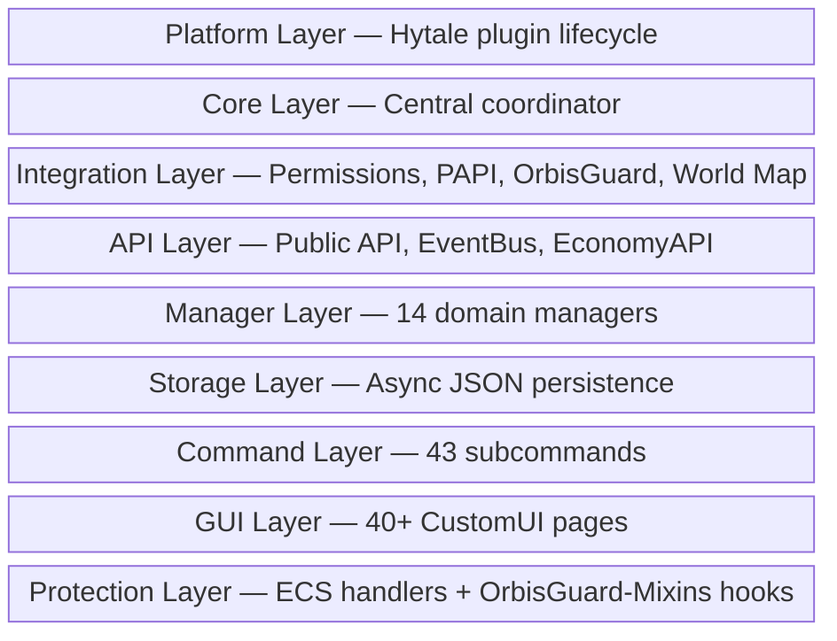

# HyperFactions Architecture

> **Version**: 0.7.0 | **302 classes** across **50 packages**

## Overview

HyperFactions is a faction management plugin providing territory claims, power mechanics, diplomatic relations, and protection systems. The architecture follows a 9-layer design:



1. **Platform Layer** - Hytale plugin lifecycle and event registration
2. **Core Layer** - Central coordinator and manager initialization
3. **Integration Layer** - Permission chain, PAPI, WiFlow, OrbisGuard, world map
4. **API Layer** - Public API for third-party mods, EventBus, EconomyAPI
5. **Manager Layer** - Business logic organized by domain (14 managers)
6. **Storage Layer** - Async JSON persistence with interfaces
7. **Command Layer** - Subcommand-based dispatcher pattern (43 subcommands)
8. **GUI Layer** - CustomUI pages with registry-based navigation (40+ pages)
9. **Protection Layer** - ECS event handlers + OrbisGuard-Mixins hooks

## Package Structure

```
src/main/java/com/hyperfactions/
├── HyperFactions.java              # Core singleton, manager orchestration
├── Permissions.java                # Permission node constants
├── BuildInfo.java                  # Auto-generated at build time
│
├── platform/                       # Hytale plugin entry point
│   └── HyperFactionsPlugin.java    # JavaPlugin lifecycle
│
├── manager/                        # Business logic layer (14 managers)
│   ├── FactionManager.java         # Faction CRUD, membership, roles
│   ├── ClaimManager.java           # Territory claim/unclaim operations
│   ├── PowerManager.java           # Player power, regeneration, penalties
│   ├── RelationManager.java        # Ally/enemy/neutral diplomacy
│   ├── ZoneManager.java            # SafeZone/WarZone management
│   ├── CombatTagManager.java       # Combat tagging, spawn protection
│   ├── TeleportManager.java        # /f home warmup/cooldown/cancel
│   ├── InviteManager.java          # Faction invites with expiration
│   ├── JoinRequestManager.java     # Join requests for closed factions
│   ├── ChatManager.java            # Faction/ally chat channels
│   ├── ConfirmationManager.java    # Text-mode command confirmations
│   ├── EconomyManager.java         # Faction economy (treasury, transactions)
│   ├── AnnouncementManager.java    # Server-wide event broadcasts
│   └── SpawnSuppressionManager.java # Mob spawn control in claims/zones
│
├── command/                        # Command system
│   ├── FactionCommand.java         # Main /f dispatcher
│   ├── FactionSubCommand.java      # Base class for subcommands
│   ├── FactionCommandContext.java  # Execution context with --text flag
│   ├── util/CommandUtil.java       # Shared command utilities
│   ├── admin/                      # Admin subcommands
│   ├── faction/                    # Faction management (create, disband, etc.)
│   ├── member/                     # Membership (invite, kick, promote, etc.)
│   ├── territory/                  # Territory (claim, unclaim, overclaim)
│   ├── teleport/                   # Teleportation (home, sethome)
│   ├── relation/                   # Diplomacy (ally, enemy, neutral)
│   ├── info/                       # Information (list, map, who, power)
│   ├── social/                     # Social (request, invites, chat)
│   └── ui/                         # UI commands (gui, settings)
│
├── gui/                            # CustomUI system
│   ├── GuiManager.java             # Central GUI coordinator
│   ├── GuiType.java                # Page type enumeration
│   ├── faction/                    # Faction member pages
│   │   ├── FactionPageRegistry.java
│   │   ├── page/                   # Page implementations
│   │   └── data/                   # Page data models
│   ├── admin/                      # Admin pages
│   │   ├── AdminPageRegistry.java
│   │   ├── AdminNavBarHelper.java
│   │   └── data/                   # Admin data models
│   ├── page/                       # Page implementations
│   │   ├── newplayer/              # Non-faction player pages
│   │   └── admin/                  # Admin page implementations
│   ├── shared/                     # Shared components
│   │   ├── component/              # Modals (InputModal, ColorPicker)
│   │   ├── page/                   # Shared pages (MainMenu, modals)
│   │   └── data/                   # Shared data models
│   └── help/                       # Help system pages
│
├── protection/                     # Territory protection
│   ├── ProtectionChecker.java      # Central protection logic
│   ├── ProtectionListener.java     # Event coordination
│   ├── SpawnProtection.java        # Respawn protection tracking
│   ├── ecs/                        # ECS event handlers
│   │   ├── BlockPlaceProtectionSystem.java
│   │   ├── BlockBreakProtectionSystem.java
│   │   ├── BlockUseProtectionSystem.java
│   │   ├── ItemPickupProtectionSystem.java
│   │   ├── ItemDropProtectionSystem.java
│   │   ├── PvPProtectionSystem.java
│   │   └── DamageProtectionSystem.java
│   ├── zone/                       # Zone-specific protection
│   │   ├── ZoneDamageProtection.java
│   │   └── ZoneInteractionProtection.java
│   ├── damage/                     # Damage type handlers
│   │   ├── DamageProtectionHandler.java
│   │   ├── PvPDamageProtection.java
│   │   ├── MobDamageProtection.java
│   │   ├── FallDamageProtection.java
│   │   ├── EnvironmentalDamageProtection.java
│   │   └── ProjectileDamageProtection.java
│   └── debug/                      # Debug tracing
│       ├── ProtectionTrace.java
│       └── PvPTrace.java
│
├── config/                         # Configuration system
│   ├── ConfigManager.java          # Central config coordinator
│   ├── ConfigFile.java             # Base config file class
│   ├── CoreConfig.java             # Main config.json
│   ├── ModuleConfig.java           # Module config base
│   ├── ValidationResult.java       # Validation tracking
│   └── modules/                    # Module configs (config/ subdir)
│       ├── BackupConfig.java
│       ├── ChatConfig.java
│       ├── DebugConfig.java
│       ├── EconomyConfig.java
│       ├── FactionPermissionsConfig.java
│       ├── AnnouncementConfig.java     # Announcement toggles
│       └── WorldMapConfig.java         # World map refresh modes
│
├── storage/                        # Persistence layer
│   ├── FactionStorage.java         # Faction storage interface
│   ├── PlayerStorage.java          # Player power storage interface
│   ├── ZoneStorage.java            # Zone storage interface
│   ├── StorageHealth.java          # Storage health monitoring
│   └── json/                       # JSON implementations
│       ├── JsonFactionStorage.java
│       ├── JsonPlayerStorage.java
│       └── JsonZoneStorage.java
│
├── data/                           # Data models (Java records)
│   ├── Faction.java                # Faction entity (mutable, builder)
│   ├── FactionMember.java          # Member record
│   ├── FactionRole.java            # LEADER, OFFICER, MEMBER enum
│   ├── FactionClaim.java           # Claim record
│   ├── FactionRelation.java        # Relation record
│   ├── FactionPermissions.java     # Territory permissions record
│   ├── FactionLog.java             # Activity log entry
│   ├── FactionEconomy.java         # Economy data (future)
│   ├── PlayerPower.java            # Player power record
│   ├── Zone.java                   # SafeZone/WarZone entity
│   ├── ZoneType.java               # SAFE, WAR enum
│   ├── ZoneFlags.java              # Zone flag constants
│   ├── RelationType.java           # OWN, ALLY, NEUTRAL, ENEMY enum
│   ├── ChunkKey.java               # World+chunk identifier
│   ├── PendingInvite.java          # Invite record
│   ├── JoinRequest.java            # Join request record
│   └── CombatTag.java              # Combat tag tracking
│
├── api/                            # Public API
│   ├── HyperFactionsAPI.java       # API entry point
│   ├── EconomyAPI.java             # Economy integration
│   └── events/                     # Custom events
│       ├── EventBus.java           # Internal event bus
│       ├── FactionCreateEvent.java
│       ├── FactionDisbandEvent.java
│       ├── FactionClaimEvent.java
│       └── FactionMemberEvent.java
│
├── integration/                    # External integrations
│   ├── PermissionManager.java      # Unified permission chain
│   ├── PermissionProvider.java     # Provider interface
│   ├── HyperPermsIntegration.java  # HyperPerms soft dependency
│   ├── HyperPermsProviderAdapter.java
│   ├── LuckPermsProvider.java      # LuckPerms permission provider
│   ├── VaultUnlockedProvider.java  # VaultUnlocked permission provider
│   ├── orbis/                      # OrbisGuard integration
│   │   ├── OrbisGuardIntegration.java    # Region conflict detection
│   │   └── OrbisMixinsIntegration.java   # 11 mixin hook callbacks
│   ├── papi/                       # PlaceholderAPI integration
│   │   ├── PlaceholderAPIIntegration.java
│   │   └── HyperFactionsExpansion.java   # 33 placeholders
│   └── wiflow/                     # WiFlow placeholder integration
│       ├── WiFlowPlaceholderIntegration.java
│       └── WiFlowExpansion.java          # 33 placeholders
│
├── backup/                         # Backup system
│   ├── BackupManager.java          # GFS backup orchestration
│   ├── BackupMetadata.java         # Backup info record
│   └── BackupType.java             # HOURLY, DAILY, WEEKLY, MANUAL, MIGRATION
│
├── update/                         # Update checking
│   ├── UpdateChecker.java          # GitHub release checker
│   ├── UpdateNotificationListener.java
│   └── UpdateNotificationPreferences.java
│
├── territory/                      # Territory features
│   ├── TerritoryNotifier.java      # Entry/exit notifications
│   ├── TerritoryInfo.java          # Territory metadata
│   └── TerritoryTickingSystem.java # ECS tick for chunk tracking
│
├── worldmap/                       # World map integration
│   ├── WorldMapService.java        # Registration + refresh coordination
│   ├── HyperFactionsWorldMap.java  # Custom map generator
│   ├── HyperFactionsWorldMapProvider.java # Map provider impl
│   └── WorldMapRefreshScheduler.java # 5 refresh modes
│
├── chat/                           # Chat formatting
│   ├── ChatContext.java            # Chat channel state
│   └── PublicChatListener.java     # Faction tag formatting
│
├── migration/                      # Data migrations
│   ├── Migration.java              # Migration interface
│   ├── MigrationRunner.java        # Execute with backup/rollback
│   ├── MigrationRegistry.java      # Migration chain builder
│   ├── MigrationResult.java        # Result record
│   ├── MigrationOptions.java       # Execution options
│   ├── MigrationType.java          # CONFIG, DATA, SCHEMA enum
│   └── migrations/config/          # Concrete migrations (v1→v2→v3→v4)
│
├── importer/                       # Data import from other plugins
│   ├── elbaphfactions/             # ElbaphFactions importer
│   └── hyfactions/                 # HyFactions V1 importer
│
├── listener/                       # Event listeners
│
├── debug/                          # Debug utilities
│   ├── ClaimTrace.java
│   └── PowerTrace.java
│
└── util/                           # Utilities
    ├── Logger.java                 # Logging with debug categories
    ├── ChunkUtil.java              # Chunk coordinate math
    ├── TimeUtil.java               # Duration formatting
    ├── CommandHelp.java            # Help text generation
    └── HelpFormatter.java          # Help formatting
```

## Core Components

### Entry Point: HyperFactionsPlugin

[`platform/HyperFactionsPlugin.java`](../src/main/java/com/hyperfactions/platform/HyperFactionsPlugin.java)

The Hytale `JavaPlugin` implementation handles:

- **setup()** - Create HyperFactions core instance
- **start()** - Initialize managers, register commands/events/systems
- **shutdown()** - Save data, cleanup resources

Key responsibilities:
- Platform callback wiring (task scheduling, player lookup)
- Event listener registration (connect, disconnect, chat)
- ECS system registration (protection, teleport, territory)
- World map provider registration
- Periodic task management (power regen, combat tag decay)

### Core Singleton: HyperFactions

[`HyperFactions.java`](../src/main/java/com/hyperfactions/HyperFactions.java)

Platform-agnostic coordinator that:

- Initializes storage implementations
- Creates and wires all managers
- Manages task scheduling via platform callbacks
- Provides getter methods for all subsystems
- Handles admin bypass toggle state

**Manager Initialization Order** (dependencies matter):
```java
factionManager = new FactionManager(factionStorage);
powerManager = new PowerManager(playerStorage, factionManager);
claimManager = new ClaimManager(factionManager, powerManager);
relationManager = new RelationManager(factionManager);
combatTagManager = new CombatTagManager();
zoneManager = new ZoneManager(zoneStorage, claimManager);
teleportManager = new TeleportManager(factionManager);
inviteManager = new InviteManager(dataDir);
joinRequestManager = new JoinRequestManager(dataDir);
announcementManager = new AnnouncementManager(onlinePlayersSupplier);
spawnSuppressionManager = new SpawnSuppressionManager(zoneManager, claimManager);
```

### Permission Constants: Permissions.java

[`Permissions.java`](../src/main/java/com/hyperfactions/Permissions.java)

Centralized permission node definitions following `<namespace>.<category>.<action>` pattern:

| Category | Wildcard | Example |
|----------|----------|---------|
| Basic | `hyperfactions.use` | Required for GUI access |
| Faction | `hyperfactions.faction.*` | `hyperfactions.faction.create` |
| Member | `hyperfactions.member.*` | `hyperfactions.member.invite` |
| Territory | `hyperfactions.territory.*` | `hyperfactions.territory.claim` |
| Teleport | `hyperfactions.teleport.*` | `hyperfactions.teleport.home` |
| Relation | `hyperfactions.relation.*` | `hyperfactions.relation.ally` |
| Chat | `hyperfactions.chat.*` | `hyperfactions.chat.faction` |
| Info | `hyperfactions.info.*` | `hyperfactions.info.list` |
| Bypass | `hyperfactions.bypass.*` | `hyperfactions.bypass.build` |
| Admin | `hyperfactions.admin.*` | `hyperfactions.admin.reload` |
| Limits | `hyperfactions.limit.claims.<N>` | Per-player numeric limits |

## Data Flow

### Command Execution

```
User Input: /f claim
     │
     ▼
FactionCommand (dispatcher)
     │ routes to subcommand
     ▼
ClaimSubCommand.execute()
     │ permission check
     │ validates state
     ▼
ClaimManager.claim(playerUuid, world, chunk)
     │ business logic
     │ updates FactionManager
     ▼
FactionStorage.saveFaction(faction)
     │ async write
     ▼
JSON file updated
```

### Protection Check

```
Block Place Event (ECS)
     │
     ▼
BlockPlaceProtectionSystem.handle()
     │
     ▼
ProtectionChecker.canInteract(playerUuid, world, x, z, BUILD)
     │
     ├─► Check admin bypass toggle
     ├─► Check bypass permissions
     ├─► Check zone flags (SafeZone/WarZone)
     ├─► Check claim owner
     ├─► Check faction membership
     ├─► Check relation (ally, enemy, neutral)
     └─► Check faction territory permissions
     │
     ▼
ProtectionResult (ALLOWED_* or DENIED_*)
     │
     ▼
Cancel event or allow
```

### GUI Navigation

```
/f command (no args)
     │
     ▼
GuiManager.openFactionMain()
     │ check faction membership
     │
     ├─► Has Faction: FactionPageRegistry.openPage(MAIN)
     │        │
     │        ▼
     │   FactionMainPage (dashboard)
     │        │ user clicks
     │        ▼
     │   Navigation via registry entries
     │
     └─► No Faction: NewPlayerPageRegistry pages
              │
              ▼
          Create/Join/Browse flow
```

## Key Patterns

### Async Storage

All storage operations return `CompletableFuture<T>`:

```java
public interface FactionStorage {
    CompletableFuture<Void> saveFaction(Faction faction);
    CompletableFuture<Optional<Faction>> loadFaction(UUID id);
    CompletableFuture<Collection<Faction>> loadAllFactions();
}
```

### Result Enums

Managers return typed results instead of boolean/exception:

```java
public enum ClaimResult {
    SUCCESS,
    NO_PERMISSION,
    NO_FACTION,
    NOT_OFFICER,
    ALREADY_CLAIMED,
    INSUFFICIENT_POWER,
    ADJACENT_REQUIRED,
    WORLD_BLACKLISTED,
    // ...
}
```

### Manager-Level Permission Checks

Permissions are checked in managers (not just commands) to ensure GUI operations are also protected:

```java
// In ClaimManager
public ClaimResult claim(UUID playerUuid, String world, int chunkX, int chunkZ) {
    if (!PermissionManager.get().hasPermission(playerUuid, Permissions.CLAIM)) {
        return ClaimResult.NO_PERMISSION;
    }
    // ... business logic
}
```

### Soft Dependencies

HyperPerms integration uses reflection-based detection:

```java
public static void init() {
    try {
        Class.forName("com.hyperperms.HyperPerms");
        hyperPermsAvailable = true;
    } catch (ClassNotFoundException e) {
        hyperPermsAvailable = false;
    }
}
```

## Extension Points

### Custom Events

Register listeners via the internal EventBus:

```java
EventBus.register(FactionDisbandEvent.class, event -> {
    // Handle faction disband
    UUID factionId = event.faction().id();
});
```

### Storage Backends

Implement storage interfaces for alternative backends:

```java
public class MySqlFactionStorage implements FactionStorage {
    // Database implementation
}
```

### Permission Providers

Add new permission sources via PermissionProvider:

```java
public class CustomProvider implements PermissionProvider {
    boolean hasPermission(UUID playerUuid, String permission);
}
```

## Code Links

### Core Classes

| Class | Path | Purpose |
|-------|------|---------|
| HyperFactionsPlugin | [`platform/HyperFactionsPlugin.java`](../src/main/java/com/hyperfactions/platform/HyperFactionsPlugin.java) | Hytale plugin lifecycle |
| HyperFactions | [`HyperFactions.java`](../src/main/java/com/hyperfactions/HyperFactions.java) | Core singleton |
| Permissions | [`Permissions.java`](../src/main/java/com/hyperfactions/Permissions.java) | Permission constants |
| ConfigManager | [`config/ConfigManager.java`](../src/main/java/com/hyperfactions/config/ConfigManager.java) | Config coordination |
| ProtectionChecker | [`protection/ProtectionChecker.java`](../src/main/java/com/hyperfactions/protection/ProtectionChecker.java) | Protection logic |
| GuiManager | [`gui/GuiManager.java`](../src/main/java/com/hyperfactions/gui/GuiManager.java) | GUI coordination |

### Data Models

| Class | Path | Purpose |
|-------|------|---------|
| Faction | [`data/Faction.java`](../src/main/java/com/hyperfactions/data/Faction.java) | Faction entity |
| FactionMember | [`data/FactionMember.java`](../src/main/java/com/hyperfactions/data/FactionMember.java) | Member record |
| PlayerPower | [`data/PlayerPower.java`](../src/main/java/com/hyperfactions/data/PlayerPower.java) | Power data |
| Zone | [`data/Zone.java`](../src/main/java/com/hyperfactions/data/Zone.java) | Zone entity |
| ChunkKey | [`data/ChunkKey.java`](../src/main/java/com/hyperfactions/data/ChunkKey.java) | Chunk identifier |
