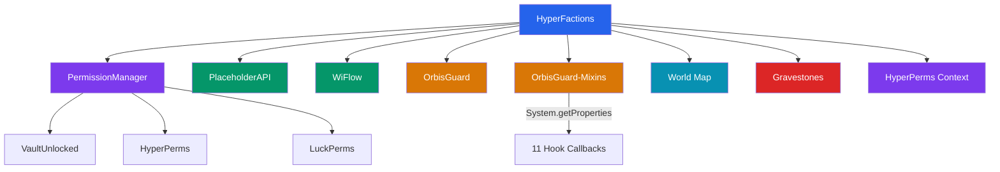
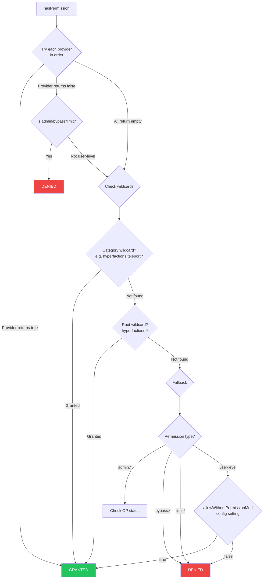

# HyperFactions Integration Breakdown

> **Version**: 0.7.2 | **Package**: `com.hyperfactions.integration`

HyperFactions integrates with external plugins through soft dependencies. All integrations use reflection-based detection and fail-open design — if a dependency is missing, the feature gracefully degrades.

---

## Table of Contents

- [Overview](#overview)
- [Permission System](#permission-system)
- [PlaceholderAPI (PAPI)](#placeholderapi-papi)
- [WiFlow PlaceholderAPI](#wiflow-placeholderapi)
- [OrbisGuard](#orbisguard)
- [OrbisGuard-Mixins](#orbisguard-mixins)
- [World Map](#world-map)
- [GravestonePlugin](#gravestoneplugin)
- [HyperPerms Context](#hyperperms-context)

---

## Overview



All integrations share these design principles:

- **Soft dependencies**: No hard dependencies in `manifest.json` — `compileOnly` at build time
- **Fail-open**: Missing integrations never cause errors or block functionality
- **Lazy initialization**: Detection happens once at startup; results are cached
- **Logging**: All integration status is logged on startup (use `debug integration` for detailed logs)
- **Detection**: Most use reflection; GravestonePlugin uses direct API with `NoClassDefFoundError` catch

---

## Permission System

HyperFactions uses a chain-of-responsibility pattern to check permissions across multiple providers. Providers are tried in priority order; the first to give a definitive answer wins.

### Provider Chain

| Priority | Provider | Detection |
|----------|----------|-----------|
| 1 | VaultUnlocked | Reflection: `at.helpch.vaultunlocked.api.*` |
| 2 | HyperPerms | Reflection: `com.hyperperms.api.*` |
| 3 | LuckPerms | Reflection: `net.luckperms.api.*` |

### PermissionProvider Interface

```java
public interface PermissionProvider {
    String getName();
    boolean isAvailable();
    Optional<Boolean> hasPermission(UUID playerUuid, String permission);
    String getPrefix(UUID playerUuid, String worldName);
    String getSuffix(UUID playerUuid, String worldName);
    String getPrimaryGroup(UUID playerUuid);
}
```

Key: `hasPermission()` returns `Optional<Boolean>`:
- `Optional.of(true)` — permission explicitly granted
- `Optional.of(false)` — permission explicitly denied
- `Optional.empty()` — provider cannot determine (player not found, etc.)

### Resolution Flow



### Wildcard Resolution

Permissions are checked in this order:
1. **Exact node**: `hyperfactions.teleport.home`
2. **Category wildcard**: `hyperfactions.teleport.*`
3. **Root wildcard**: `hyperfactions.*`
4. **Fallback**: Based on permission type

### Fallback Rules

When no provider can answer:

| Permission Type | Fallback Behavior |
|----------------|-------------------|
| `hyperfactions.admin.*` | Requires OP (checks Hytale PermissionsModule) |
| `hyperfactions.bypass.*` | Always denied |
| `hyperfactions.limit.*` | Always denied (config defaults used instead) |
| User-level permissions | Configurable via `allowWithoutPermissionMod` |

---

## PlaceholderAPI (PAPI)

**Package**: `com.hyperfactions.integration.papi`
**Identifier**: `factions`
**Format**: `%factions_<placeholder>%`

Registered via `PlaceholderExpansion` from the PlaceholderAPI library. Persists across reloads (`persist() = true`).

> **Full Placeholder Reference**: See [placeholders.md](placeholders.md) for complete list of all 35 placeholders with null behavior, usage examples, and configuration details.

---

## WiFlow PlaceholderAPI

**Package**: `com.hyperfactions.integration.wiflow`
**Format**: `{factions_<placeholder>}`

WiFlow uses curly braces instead of percent signs but supports the same placeholders as PAPI. The `WiFlowExpansion` class mirrors `HyperFactionsExpansion` exactly, using WiFlow's `PlaceholderContext` instead of PAPI's `PlayerRef`.

> **Full Placeholder Reference**: See [placeholders.md](placeholders.md) for complete list of all 35 placeholders with null behavior, usage examples, and configuration details.

---

## OrbisGuard

**Package**: `com.hyperfactions.integration.orbis`
**Purpose**: Prevents faction claims in OrbisGuard-protected regions

When OrbisGuard is installed, HyperFactions checks for protective regions before allowing territory claims. If a chunk overlaps an OrbisGuard region, the claim is denied.

### How It Works

1. On startup, HyperFactions attempts to load `com.orbisguard.api.OrbisGuardAPI` via reflection
2. If found, it caches `MethodHandle` references for region container access
3. During claim attempts, `isChunkProtected(world, chunkX, chunkZ)` checks the chunk center for regions
4. If regions are found, the claim is denied with an appropriate message

### Methods

| Method | Description |
|--------|-------------|
| `isAvailable()` | Whether OrbisGuard is installed |
| `hasProtectiveRegions(world, x, y, z)` | Check for regions at exact coordinates |
| `isChunkProtected(world, chunkX, chunkZ)` | Check chunk center (block X/Z + 8, Y=64) |

> **Note**: Checks only the chunk center for performance. Region checks are fail-open — if OrbisGuard errors, claims proceed normally.

---

## OrbisGuard-Mixins

**Package**: `com.hyperfactions.integration.orbis`
**Purpose**: Enhanced protection via Hyxin mixin hooks for events not available through normal APIs

OrbisGuard-Mixins extends protection coverage to interactions that Hytale's event system doesn't expose (F-key pickup, hammer cycling, campfire toggling, etc.). It uses `System.getProperties()` for cross-classloader communication — no direct dependency required.

### Detection

Mixins set system properties on load:

| Property | Set By |
|----------|--------|
| `orbisguard.mixins.loaded` | Pickup mixin (may load late) |
| `orbisguard.mixin.durability.loaded` | Durability mixin (loads early, targets `Player.class`) |
| `orbisguard.mixin.pickup.loaded` | Pickup mixin |
| `orbisguard.mixin.death.loaded` | Death mixin |
| `orbisguard.mixin.seating.loaded` | Seating mixin |

HyperFactions accepts any of these as evidence that OrbisGuard-Mixins is installed. A `refreshStatus()` method handles late-loading mixins.

### Hook Types (11)

All hooks are registered in a shared `ConcurrentHashMap` stored in `System.getProperties()` under `orbisguard.hook.registry`. Mixins find hooks via reflection by matching method signatures.

| Hook | Callback Interface | Protects Against |
|------|--------------------|-----------------|
| **Pickup** | `PickupCheckCallback` | F-key and auto item pickup |
| **Hammer** | `HammerCheckCallback` | Hammer block cycling |
| **Harvest** | `HarvestCheckCallback` | F-key crop harvesting |
| **Place** | `PlaceCheckCallback` | Bucket/fluid placement |
| **Use** | `UseCheckCallback` | Block interaction (campfire, lantern toggle) |
| **Seat** | `SeatCheckCallback` | Seating on blocks |
| **Explosion** | `ExplosionCheckCallback` | Explosion block damage |
| **Command** | `CommandCheckCallback` | Command blocking in zones |
| **Death** | `DeathCheckCallback` | Keep inventory on death |
| **Durability** | `DurabilityCheckCallback` | Durability loss prevention |
| **Spawn** | `SpawnCheckCallback` | Mob spawning control |

### Callback Signatures

```java
// Most hooks follow this pattern:
boolean isAllowed(UUID playerUuid, String worldName, int x, int y, int z);

// Exceptions:
// Pickup: check(UUID, String, double, double, double, String mode) -> boolean
// Harvest: check(UUID, String, int, int, int) -> String (null=allowed, non-null=denial message)
// Explosion: shouldBlockExplosion(String worldName, int x, int y, int z) -> boolean (no player)
// Spawn: shouldBlockSpawn(String worldName, int x, int y, int z) -> boolean (no player)
// Command: shouldBlockCommand(UUID, String, int, int, int, String command) -> CommandCheckResult
```

### Fail-Open Design

Every hook wrapper catches exceptions and returns the permissive default:
- `true` (allowed) for permission checks
- `false` (don't block) for block checks
- `null` (allowed) for harvest/string checks

---

## World Map

**Package**: `com.hyperfactions.worldmap`
**Purpose**: Renders faction claims as colored overlays on Hytale's built-in world map

### Components

| Class | Role |
|-------|------|
| `WorldMapService` | Registration with Hytale's world map system |
| `HyperFactionsWorldMapProvider` | Generates claim overlay images |
| `HyperFactionsWorldMap` | Custom world map with faction colors |
| `WorldMapRefreshScheduler` | Manages refresh timing and batching |

### Refresh Modes

The `WorldMapRefreshScheduler` supports 5 modes, configurable in `config/worldmap.json`:

| Mode | Behavior | Best For |
|------|----------|----------|
| **PROXIMITY** (default) | Selective cache clear + notify nearby players only | Busy servers |
| **INCREMENTAL** | Selective cache clear + notify all players | Balanced |
| **DEBOUNCED** | Full refresh after quiet period with no changes | Constant claim activity |
| **IMMEDIATE** | Full refresh on every change | Backwards compatibility |
| **MANUAL** | No auto-refresh; use `/f admin map refresh` | Full control |

Selective modes use `WorldMapManager.clearImagesInChunks()` for targeted invalidation. Full modes use `WorldMapManager.clearImages()`.

### Configuration

Key settings in `config/worldmap.json`:

- `enabled` — Enable/disable world map integration
- `refreshMode` — One of the 5 modes above
- `chunkRadius` — Radius for proximity notifications
- `batchInterval` — Milliseconds between batch updates
- `maxChunksPerBatch` — Throttle for large updates
- `showFactionTags` — Display faction names on the map

---

## GravestonePlugin

**Package**: `com.hyperfactions.integration`
**Purpose**: Faction-aware gravestone access control using direct v2 API
**Detection**: `GravestonePlugin.getInstance()` (wrapped in `NoClassDefFoundError` catch)

### How It Works

HyperFactions registers a `GravestoneAccessChecker` with the gravestone plugin during startup. This checker is called whenever a player attempts to interact with or break a gravestone. The checker returns a tri-state `AccessResult`:

- **ALLOW** — Access granted (admin bypass, permission bypass, zone/territory allows)
- **DENY** — Access denied (zone flag, territory protection)
- **DEFER** — Let gravestone's built-in ownership check decide (owner accessing own, unknown state)

### ECS Protection Bypass

When the integration is active, gravestone blocks bypass normal zone/faction protection in `BlockUseProtectionSystem` and `BlockBreakProtectionSystem`. Access control is handled exclusively by the registered AccessChecker. If the integration is unavailable, normal protection applies as fallback.

### AccessChecker Decision Flow

1. **Config disabled** → DEFER (integration inactive)
2. **Admin bypass** (has `hyperfactions.admin.use` + bypass toggle ON) → ALLOW
3. **Permission bypass** (non-admin with `hyperfactions.gravestone.bypass`) → ALLOW
4. **Owner accessing own** → DEFER (let gravestone plugin handle)
5. **Zone flag** (`gravestone_access`) → ALLOW or DENY based on zone setting
6. **Territory + relation** → Based on config (see decision matrix below)

### Zone Flag

`gravestone_access` — Controls whether non-owners can loot/break other players' gravestones in a zone. Owners can always access their own gravestone regardless of this flag. Configurable in the Admin GUI via Zone Settings > Integration Flags.

| Zone Type | Default |
|-----------|---------|
| SafeZone | `false` (protected) |
| WarZone | `true` (free for all) |

### Territory Decision Matrix

| Location | Accessor Relation | Result | Config Setting |
|----------|-------------------|--------|----------------|
| Own territory | Same faction member | ALLOW if membersCanAccess | `factionMembersCanAccess` |
| Own territory | Outsider's gravestone | ALLOW | `protectInOwnTerritory` |
| Ally territory | Any non-owner | ALLOW if alliesCanAccess | `alliesCanAccess` |
| Enemy territory | Any non-owner | ALLOW if !protectInEnemy | `protectInEnemyTerritory` |
| Neutral territory | Any non-owner | DENY if protectInNeutral | `protectInNeutralTerritory` |
| Wilderness | Any non-owner | ALLOW if !protectInWild | `protectInWilderness` |

### Configuration

All settings in `config/gravestones.json`:

| Setting | Default | Description |
|---------|---------|-------------|
| `enabled` | `true` | Enable/disable the integration |
| `protectInOwnTerritory` | `true` | Protect gravestones in faction's own territory |
| `factionMembersCanAccess` | `true` | Faction members can access each other's gravestones |
| `alliesCanAccess` | `false` | Allied factions can access gravestones |
| `protectInEnemyTerritory` | `false` | Protect gravestones in enemy territory |
| `protectInNeutralTerritory` | `true` | Protect gravestones in neutral territory |
| `enemiesCanLootInOwnTerritory` | `false` | Enemies can loot gravestones in your territory |
| `protectInSafeZone` | `true` | Protect in SafeZones (via zone flag) |
| `protectInWarZone` | `false` | Protect in WarZones (via zone flag) |
| `protectInWilderness` | `false` | Protect in unclaimed wilderness |
| `announceDeathLocation` | `true` | Announce death location to faction members |
| `allowLootDuringRaid` | `true` | Allow looting during raids (placeholder) |
| `allowLootDuringWar` | `true` | Allow looting during wars (placeholder) |

### Event Listeners

Gravestone lifecycle events are logged when `debug integration` is enabled:

- `GravestoneCreatedEvent` — Logs owner, coordinates, world
- `GravestoneCollectedEvent` — Logs collector, owner, coordinates
- `GravestoneBrokenEvent` — Logs breaker, owner, coordinates

### Admin Commands

- `/f admin integrations` — Summary status of all 7 integrations (permissions, protection, placeholders)
- `/f admin integration <name>` — Detailed status for a specific integration
  - Names: `hyperperms`/`perms`, `orbisguard`/`orbis`, `mixins`, `gravestones`/`gs`, `papi`, `wiflow`
- `/f admin debug toggle integration` — Enable/disable integration debug logging

### Graceful Degradation

GravestonePlugin is fully optional:

1. **Compile-time**: Gravestones JAR is `compileOnly` — not bundled into the HyperFactions shadow JAR
2. **Runtime init**: `GravestoneIntegration.init()` wraps all API calls in `NoClassDefFoundError` catch — if gravestone classes aren't on classpath, `available = false`
3. **ECS systems**: Check `isAvailable()` before bypassing protection — if inactive, normal protection applies
4. **Config**: Settings load/save regardless of plugin availability

---

## HyperPerms Context

When HyperPerms is installed, HyperFactions registers context keys that enable contextual permission grants. For example, you can give members extra permissions only when they're in their own faction's territory.

### Context Keys

| Key | Value | Example |
|-----|-------|---------|
| `faction` | Player's faction name | `Warriors` |
| `faction_role` | Player's role in faction | `leader`, `officer`, `member` |
| `faction_territory` | Territory type at location | `own`, `ally`, `enemy`, `neutral`, `wilderness`, `safezone`, `warzone` |
| `relation` | Relation to territory owner | `self`, `ally`, `enemy`, `neutral` |

### Example Usage in HyperPerms

```
# Allow extra claims only in own territory
/hperms user Steve permission set hyperfactions.limit.claims.100 context faction_territory=own

# Allow ally chat only for officers
/hperms group officers permission set hyperfactions.chat.ally context faction_role=officer
```
