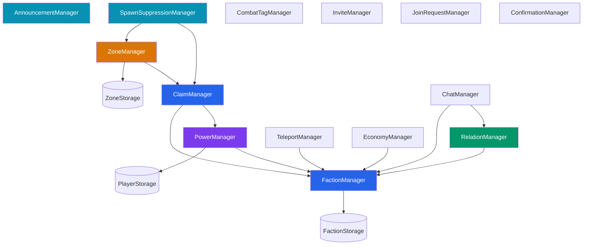

# HyperFactions Manager Layer

> **Version**: 0.7.0 | **14 managers**

The manager layer contains all business logic for HyperFactions, organized by domain.

## Overview

Managers are initialized in [`HyperFactions.java`](../src/main/java/com/hyperfactions/HyperFactions.java) with explicit dependency injection. Each manager:

- Owns a specific domain of functionality
- Performs permission checks before operations
- Returns typed result enums (not boolean/exception)
- Uses async storage via `CompletableFuture`



## Manager Index

| Manager | Responsibility | Dependencies |
|---------|----------------|--------------|
| [FactionManager](#factionmanager) | Faction CRUD, membership, roles | FactionStorage |
| [ClaimManager](#claimmanager) | Territory claiming/unclaiming | FactionManager, PowerManager |
| [PowerManager](#powermanager) | Player power, regen, penalties | PlayerStorage, FactionManager |
| [RelationManager](#relationmanager) | Diplomatic relations | FactionManager |
| [ZoneManager](#zonemanager) | SafeZone/WarZone management | ZoneStorage, ClaimManager |
| [CombatTagManager](#combattagmanager) | Combat tagging, spawn protection | None |
| [TeleportManager](#teleportmanager) | Faction home teleportation | FactionManager |
| [InviteManager](#invitemanager) | Faction invites with expiration | None |
| [JoinRequestManager](#joinrequestmanager) | Join requests for closed factions | None |
| [ChatManager](#chatmanager) | Faction/ally chat channels | FactionManager, RelationManager |
| [ConfirmationManager](#confirmationmanager) | Text-mode confirmations | None |
| [EconomyManager](#economymanager) | Faction economy (treasury, transactions) | FactionManager |
| [AnnouncementManager](#announcementmanager) | Server-wide event broadcasts | None |
| [SpawnSuppressionManager](#spawnsuppressionmanager) | Mob spawn control in claims/zones | ZoneManager, ClaimManager |

## Initialization Order

Order matters due to dependencies:

```java
// 1. Storage-backed managers (no dependencies on other managers)
factionManager = new FactionManager(factionStorage);

// 2. Managers that depend on FactionManager
powerManager = new PowerManager(playerStorage, factionManager);
relationManager = new RelationManager(factionManager);
teleportManager = new TeleportManager(factionManager);

// 3. Managers that depend on multiple managers
claimManager = new ClaimManager(factionManager, powerManager);
zoneManager = new ZoneManager(zoneStorage, claimManager);

// 4. Chat manager needs FactionManager + RelationManager
chatManager = new ChatManager(factionManager, relationManager, playerLookup);

// 5. Standalone managers (no manager dependencies)
combatTagManager = new CombatTagManager();
inviteManager = new InviteManager(dataDir);
joinRequestManager = new JoinRequestManager(dataDir);
confirmationManager = new ConfirmationManager();
```

---

## FactionManager

[`manager/FactionManager.java`](../src/main/java/com/hyperfactions/manager/FactionManager.java)

Core faction lifecycle and membership management.

### Responsibilities

- Create/disband factions
- Add/remove/kick members
- Promote/demote members
- Transfer leadership
- Update faction properties (name, description, tag, color)
- Track member last online timestamps
- Manage faction permissions (territory flags)

### Key Methods

| Method | Permission | Returns |
|--------|------------|---------|
| `createFaction(player, name)` | `faction.create` | `FactionResult` |
| `disbandFaction(playerUuid)` | `faction.disband` | `FactionResult` |
| `addMember(factionId, playerUuid, username)` | - | `boolean` |
| `removeMember(factionId, playerUuid)` | - | `boolean` |
| `kickMember(kickerUuid, targetUuid)` | `member.kick` | `FactionResult` |
| `promoteMember(promoterUuid, targetUuid)` | `member.promote` | `FactionResult` |
| `demoteMember(demoterUuid, targetUuid)` | `member.demote` | `FactionResult` |
| `transferLeadership(leaderUuid, newLeaderUuid)` | `member.transfer` | `FactionResult` |
| `setFactionHome(playerUuid, location)` | `teleport.sethome` | `FactionResult` |

### Result Enum

```java
public enum FactionResult {
    SUCCESS,
    NO_PERMISSION,
    NO_FACTION,
    NOT_LEADER,
    NOT_OFFICER,
    NAME_TOO_SHORT,
    NAME_TOO_LONG,
    NAME_TAKEN,
    TARGET_NOT_FOUND,
    TARGET_NOT_IN_FACTION,
    CANNOT_TARGET_SELF,
    ALREADY_IN_FACTION,
    FACTION_FULL
}
```

### Data Access

```java
// Get faction by ID
Optional<Faction> faction = factionManager.getFaction(factionId);

// Get player's faction
UUID factionId = factionManager.getPlayerFactionId(playerUuid);
Faction faction = factionManager.getPlayerFaction(playerUuid);

// Check same faction
boolean same = factionManager.areInSameFaction(player1, player2);

// Get all factions
Collection<Faction> all = factionManager.getAllFactions();
```

---

## ClaimManager

[`manager/ClaimManager.java`](../src/main/java/com/hyperfactions/manager/ClaimManager.java)

Territory claiming and chunk ownership tracking.

### Responsibilities

- Claim/unclaim chunks for factions
- Overclaim (take territory from weaker factions)
- Track chunk ownership via spatial index
- Validate claim constraints (adjacency, world whitelist/blacklist)
- Calculate claim limits based on faction power

### Key Methods

| Method | Permission | Returns |
|--------|------------|---------|
| `claim(playerUuid, world, chunkX, chunkZ)` | `territory.claim` | `ClaimResult` |
| `unclaim(playerUuid, world, chunkX, chunkZ)` | `territory.unclaim` | `ClaimResult` |
| `overclaim(playerUuid, world, chunkX, chunkZ)` | `territory.overclaim` | `ClaimResult` |
| `getClaimOwner(world, chunkX, chunkZ)` | - | `UUID` (factionId) |
| `getClaimCount(factionId)` | - | `int` |
| `getFactionClaims(factionId)` | - | `List<FactionClaim>` |

### Result Enum

```java
public enum ClaimResult {
    SUCCESS,
    NO_PERMISSION,
    NO_FACTION,
    NOT_OFFICER,
    ALREADY_CLAIMED,
    ALREADY_YOURS,
    INSUFFICIENT_POWER,
    MAX_CLAIMS_REACHED,
    ADJACENT_REQUIRED,
    WORLD_BLACKLISTED,
    NOT_IN_WHITELIST,
    TARGET_NOT_OVERCLAIMABLE,
    ZONE_CONFLICT
}
```

### Claim Index

Claims are indexed by `ChunkKey` (world + chunk coordinates) for O(1) lookups:

```java
private final Map<ChunkKey, UUID> claimIndex = new ConcurrentHashMap<>();

public UUID getClaimOwner(String world, int chunkX, int chunkZ) {
    return claimIndex.get(new ChunkKey(world, chunkX, chunkZ));
}
```

---

## PowerManager

[`manager/PowerManager.java`](../src/main/java/com/hyperfactions/manager/PowerManager.java)

Player power mechanics that limit territory claiming.

### Responsibilities

- Track individual player power levels
- Apply death penalties
- Apply combat logout penalties
- Regenerate power over time
- Calculate faction total power
- Load/save player power data

### Key Methods

| Method | Purpose |
|--------|---------|
| `getPlayerPower(playerUuid)` | Get current power |
| `getMaxPower(playerUuid)` | Get max power (may be permission-based) |
| `applyDeathPenalty(playerUuid)` | Reduce power on death |
| `applyCombatLogoutPenalty(playerUuid, amount)` | Reduce power on combat log |
| `tickPowerRegen()` | Called periodically to regenerate power |
| `getFactionPower(factionId)` | Sum of all member power |
| `playerOnline(playerUuid)` | Mark player as online |
| `playerOffline(playerUuid)` | Mark player as offline |

### Power Formula

```
Faction Max Claims = min(
    floor(totalFactionPower / powerPerClaim),
    configMaxClaims
)
```

Where:
- `totalFactionPower` = sum of all online member power (+ offline if configured)
- `powerPerClaim` = config value (default: 2.0)
- `configMaxClaims` = hard cap from config (default: 100)

---

## RelationManager

[`manager/RelationManager.java`](../src/main/java/com/hyperfactions/manager/RelationManager.java)

Diplomatic relations between factions.

### Responsibilities

- Track ally/enemy/neutral relations
- Handle ally requests (two-way handshake)
- Enforce relation limits (max allies, max enemies)
- Provide relation lookups for protection/chat

### Key Methods

| Method | Permission | Returns |
|--------|------------|---------|
| `requestAlly(playerUuid, targetFactionId)` | `relation.ally` | `RelationResult` |
| `acceptAlly(playerUuid, requesterFactionId)` | `relation.ally` | `RelationResult` |
| `setEnemy(playerUuid, targetFactionId)` | `relation.enemy` | `RelationResult` |
| `setNeutral(playerUuid, targetFactionId)` | `relation.neutral` | `RelationResult` |
| `getRelation(factionId1, factionId2)` | - | `RelationType` |
| `getPlayerRelation(player1, player2)` | - | `RelationType` |

### Relation Types

```java
public enum RelationType {
    OWN,      // Same faction
    ALLY,     // Allied factions
    NEUTRAL,  // Default state
    ENEMY     // Declared enemies
}
```

### Ally Handshake

Ally relationships require mutual agreement:

1. Faction A requests ally with Faction B
2. Request is stored as pending
3. Faction B accepts the request
4. Both factions marked as allies

---

## ZoneManager

[`manager/ZoneManager.java`](../src/main/java/com/hyperfactions/manager/ZoneManager.java)

Admin-controlled SafeZones and WarZones.

### Responsibilities

- Create/delete zones
- Claim/unclaim chunks for zones
- Manage zone flags (PvP, build, interact, etc.)
- Priority over faction claims (zones override)
- Persist zone data

### Key Methods

| Method | Purpose |
|--------|---------|
| `createZone(name, type, creatorUuid)` | Create new zone |
| `deleteZone(zoneId)` | Delete zone and release chunks |
| `claimChunk(zoneId, world, chunkX, chunkZ)` | Add chunk to zone |
| `unclaimChunk(world, chunkX, chunkZ)` | Remove chunk from zone |
| `getZone(world, chunkX, chunkZ)` | Get zone at location |
| `isInSafeZone(world, chunkX, chunkZ)` | Check if SafeZone |
| `isInWarZone(world, chunkX, chunkZ)` | Check if WarZone |
| `setFlag(zoneId, flagName, value)` | Set zone flag |

### Zone Flags

Defined in [`data/ZoneFlags.java`](../src/main/java/com/hyperfactions/data/ZoneFlags.java):

| Flag | SafeZone Default | WarZone Default |
|------|------------------|-----------------|
| `pvp_enabled` | false | true |
| `friendly_fire` | false | false |
| `build_allowed` | false | false |
| `block_interact` | true | true |
| `item_drop` | true | true |
| `item_pickup` | true | true |
| `mob_damage` | false | true |
| `fall_damage` | false | true |
| `environmental_damage` | false | true |

---

## CombatTagManager

[`manager/CombatTagManager.java`](../src/main/java/com/hyperfactions/manager/CombatTagManager.java)

Combat tagging and spawn protection tracking.

### Responsibilities

- Tag players when they enter combat
- Track tag expiration
- Detect combat logout
- Manage spawn protection (respawn invincibility)
- Call logout penalty callback

### Key Methods

| Method | Purpose |
|--------|---------|
| `tagPlayers(attacker, defender)` | Tag both players |
| `isTagged(playerUuid)` | Check if combat tagged |
| `getRemainingTagSeconds(playerUuid)` | Get tag time left |
| `handleDisconnect(playerUuid)` | Process disconnect (returns wasTagged) |
| `grantSpawnProtection(playerUuid)` | Grant respawn protection |
| `hasSpawnProtection(playerUuid)` | Check if spawn protected |
| `clearSpawnProtection(playerUuid)` | Remove spawn protection |
| `tickDecay()` | Called every second to expire tags |

### Combat Tag Flow

```
Player A attacks Player B
     │
     ▼
tagPlayers(A, B)
     │
     ├─► Both tagged for tagDurationSeconds
     │
     ▼
If player disconnects while tagged:
     │
     ▼
handleDisconnect() returns true
     │
     ▼
onCombatLogout callback invoked
     │
     ▼
Power penalty applied via PowerManager
```

---

## TeleportManager

[`manager/TeleportManager.java`](../src/main/java/com/hyperfactions/manager/TeleportManager.java)

Faction home teleportation with warmup/cooldown.

### Responsibilities

- Track pending teleports
- Manage warmup timers
- Enforce cooldowns
- Cancel on movement or damage (if configured)
- Execute teleport via platform callback

### Key Methods

| Method | Permission | Returns |
|--------|------------|---------|
| `teleportToHome(playerUuid, ...)` | `teleport.home` | `TeleportResult` |
| `cancelPending(playerUuid, taskCanceller)` | - | `boolean` |
| `cancelOnMove(playerUuid, ...)` | - | `void` |
| `cancelOnDamage(playerUuid, ...)` | - | `void` |
| `isOnCooldown(playerUuid)` | - | `boolean` |
| `getCooldownRemaining(playerUuid)` | - | `long` (ms) |

### Result Enum

```java
public enum TeleportResult {
    SUCCESS,
    WARMUP_STARTED,
    NO_PERMISSION,
    NO_FACTION,
    NO_HOME_SET,
    ON_COOLDOWN,
    ALREADY_PENDING,
    COMBAT_TAGGED
}
```

---

## InviteManager

[`manager/InviteManager.java`](../src/main/java/com/hyperfactions/manager/InviteManager.java)

Faction invites with expiration.

### Responsibilities

- Create invites with expiration timestamps
- Track pending invites per player
- Validate and accept invites
- Clean up expired invites
- Persist invites to survive restarts

### Key Methods

| Method | Permission | Returns |
|--------|------------|---------|
| `createInviteChecked(inviterUuid, targetUuid)` | `member.invite` | `InviteResult` |
| `acceptInvite(playerUuid, factionId)` | - | `InviteResult` |
| `getPlayerInvites(playerUuid)` | - | `List<PendingInvite>` |
| `cleanupExpired()` | - | Called periodically |

---

## JoinRequestManager

[`manager/JoinRequestManager.java`](../src/main/java/com/hyperfactions/manager/JoinRequestManager.java)

Join requests for closed factions.

### Responsibilities

- Create join requests with optional messages
- Track requests per faction
- Allow officers to accept/deny
- Clean up expired requests
- Persist requests to survive restarts

### Key Methods

| Method | Permission | Returns |
|--------|------------|---------|
| `createRequestChecked(playerUuid, factionId, message)` | `member.join` | `RequestResult` |
| `acceptRequest(officerUuid, requestId)` | - | `RequestResult` |
| `denyRequest(officerUuid, requestId)` | - | `RequestResult` |
| `getFactionRequests(factionId)` | - | `List<JoinRequest>` |

---

## ChatManager

[`manager/ChatManager.java`](../src/main/java/com/hyperfactions/manager/ChatManager.java)

Faction and ally chat channels.

### Responsibilities

- Track player chat channel state
- Route messages to faction/ally channels
- Format chat messages with faction info
- Provide relation colors for public chat

### Key Methods

| Method | Permission | Returns |
|--------|------------|---------|
| `toggleFactionChatChecked(playerUuid)` | `chat.faction` | `ChatResult` |
| `toggleAllyChatChecked(playerUuid)` | `chat.ally` | `ChatResult` |
| `processChatMessage(sender, message)` | - | `boolean` (was handled) |
| `resetChannel(playerUuid)` | - | Reset to public |

### Chat Channels

```java
public enum ChatChannel {
    PUBLIC,   // Normal server chat
    FACTION,  // Only faction members see
    ALLY      // Faction + allied factions see
}
```

---

## ConfirmationManager

[`manager/ConfirmationManager.java`](../src/main/java/com/hyperfactions/manager/ConfirmationManager.java)

Text-mode command confirmations for destructive actions.

### Responsibilities

- Store pending confirmations with expiration
- Validate confirmation codes
- Execute confirmed actions

### Usage Pattern

```java
// In command: request confirmation
String code = confirmationManager.createConfirmation(
    playerUuid, "disband", () -> doDisband()
);
sendMessage("Type /f confirm " + code);

// In /f confirm: execute if valid
confirmationManager.confirm(playerUuid, code); // runs callback
```

---

## EconomyManager

[`manager/EconomyManager.java`](../src/main/java/com/hyperfactions/manager/EconomyManager.java)

Faction treasury management implementing the `EconomyAPI` interface.

### Responsibilities

- Manage faction balance (deposit, withdraw, transfer)
- Record transaction history (max 50 per faction)
- Currency formatting and naming
- Upkeep deductions, tax collection, war/raid costs

### Key Methods

| Method | Returns | Description |
|--------|---------|-------------|
| `getFactionBalance(factionId)` | `double` | Get treasury balance |
| `hasFunds(factionId, amount)` | `boolean` | Check sufficient funds |
| `deposit(factionId, amount, actorId, desc)` | `CompletableFuture<TransactionResult>` | Deposit into treasury |
| `withdraw(factionId, amount, actorId, desc)` | `CompletableFuture<TransactionResult>` | Withdraw from treasury |
| `transfer(fromId, toId, amount, actorId, desc)` | `CompletableFuture<TransactionResult>` | Inter-faction transfer |
| `getTransactionHistory(factionId, limit)` | `List<Transaction>` | Recent transactions |
| `formatCurrency(amount)` | `String` | Formatted display string |

See [API Reference](api.md#economy-api) for the full `EconomyAPI` interface.

---

## AnnouncementManager

[`manager/AnnouncementManager.java`](../src/main/java/com/hyperfactions/manager/AnnouncementManager.java)

Server-wide broadcasts for significant faction events.

### Responsibilities

- Broadcast formatted messages to all online players
- Check per-event toggle configuration
- Use configured prefix from messages config

### Key Methods

| Method | Event | Color |
|--------|-------|-------|
| `announceFactionCreated(name, leader)` | Faction founded | `#55FF55` |
| `announceFactionDisbanded(name)` | Faction disbanded | `#FF5555` |
| `announceLeadershipTransfer(name, old, new)` | Leadership change | `#FFAA00` |
| `announceOverclaim(attacker, defender)` | Territory overclaimed | `#FF5555` |
| `announceWarDeclared(declarer, target)` | War declared | `#FF5555` |
| `announceAllianceFormed(faction1, faction2)` | Alliance formed | `#55FF55` |
| `announceAllianceBroken(faction1, faction2)` | Alliance broken | `#FFAA00` |

See [Announcements](announcements.md) for configuration and admin exclusion details.

---

## SpawnSuppressionManager

[`manager/SpawnSuppressionManager.java`](../src/main/java/com/hyperfactions/manager/SpawnSuppressionManager.java)

Controls mob spawning in faction territory and zones using Hytale's native spawn suppression API.

### Responsibilities

- Resolve NPC group indices (hostile, passive, neutral)
- Apply spawn suppression per world based on zone flags and faction permissions
- Update suppression when zones or claims change
- Generate unique suppressor IDs via XOR of prefix + zone/faction ID

### Key Methods

| Method | Purpose |
|--------|---------|
| `initialize()` | Resolve NPC group indices |
| `applyToWorld(world)` | Apply suppression for a specific world |
| `applyToAllWorlds()` | Apply suppression across all worlds |
| `updateZoneSuppression(zone)` | Update for a specific zone change |

### Suppression Flags

Controlled by faction territory permissions and zone flags:

| Flag | Controls |
|------|----------|
| `MOB_SPAWNING` | All mob spawning (parent) |
| `HOSTILE_MOB_SPAWNING` | Hostile mob spawning |
| `PASSIVE_MOB_SPAWNING` | Passive mob spawning |
| `NEUTRAL_MOB_SPAWNING` | Neutral mob spawning |

Uses prefixed UUIDs: `HFAC` for zones, `HFCL` for claims. Y-range: -64 to 320.
